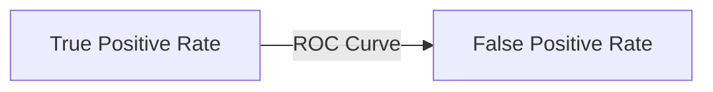
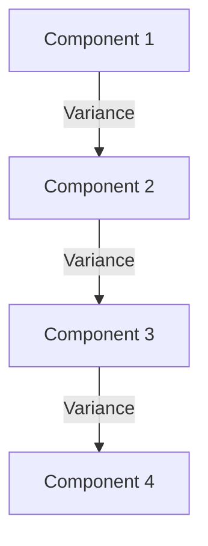

# MLToolkit

A comprehensive toolkit for machine learning projects, including essential libraries, evaluation metrics, and best practices for both supervised and unsupervised learning.

---

## 📦 Features

- **Pre-configured requirements** for data science and ML workflows
- **Evaluation metrics** for a wide range of algorithms
- **.gitignore** for clean project management
- **Ready for Jupyter Notebooks and VS Code**

---

## 🛠️ Installation

```bash
# Clone the repository
git clone https://github.com/MahmoudAbuAwd/MLToolkit.git

# Navigate to the project directory
cd MLToolkit

# (Optional) Create a virtual environment
python -m venv venv
source venv/bin/activate  # On Windows: venv\Scripts\activate

# Install dependencies
pip install -r requirements.txt
```

---

## 📊 Evaluation Metrics

### Supervised Learning

| Algorithm                | Metrics                                                                 |
|--------------------------|-------------------------------------------------------------------------|
| **Linear Regression**    | MAE, MSE, RMSE, R²                                                      |
| **Logistic Regression**  | Accuracy, Precision, Recall, F1 Score, ROC-AUC                          |
| **KNN, SVM, Decision Tree, Random Forest, GBM, Neural Networks** | Accuracy, Precision, Recall, F1 Score, ROC-AUC |
| **Ensemble Methods**     | Accuracy, Precision, Recall, F1 Score, ROC-AUC                          |

### Unsupervised Learning

| Algorithm                | Metrics                                                                 |
|--------------------------|-------------------------------------------------------------------------|
| **K-Means**              | Silhouette Score, Inertia, Davies-Bouldin Index                         |
| **Hierarchical Clustering** | Silhouette Score, Cophenetic Correlation, Dunn Index                |
| **DBSCAN**               | Silhouette Score, Adjusted Rand Index, Davies-Bouldin Index             |
| **PCA**                  | Explained Variance Ratio, Reconstruction Error, Scree Plot              |
| **t-SNE**                | Perplexity, KL Divergence, Visualization                                |

---

## 📈 Visualizations

### Regression Metrics


*Example: Visualizing MAE, MSE, RMSE, and R² for regression models.*

---

### Classification Metrics


*Confusion Matrix for classification models.*

---

### Clustering Metrics


*Silhouette Score visualization for clustering algorithms.*

---

## 📚 Example Diagrams

### 1. ROC Curve



### 2. Scree Plot (PCA)



---

## 🚀 Usage

- Use the provided requirements.txt to set up your environment.
- Refer to `Evaluation metrics.txt` for choosing the right metrics.
- Visualize your results using matplotlib or seaborn.

---

## 🤝 Contributing

Contributions are welcome! Please open issues or submit pull requests.

---

## 📄 License

MIT License

---

*Happy Machine Learning!*
